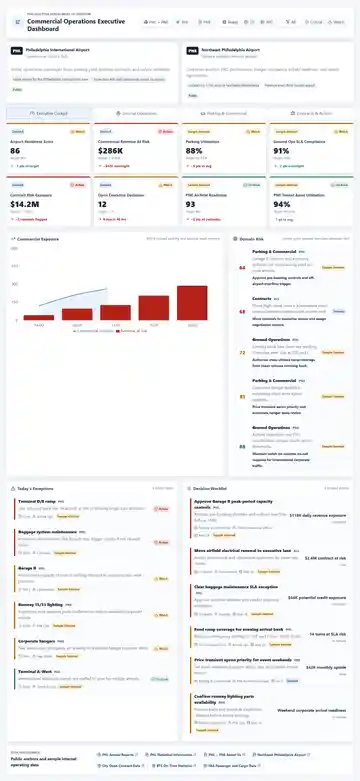
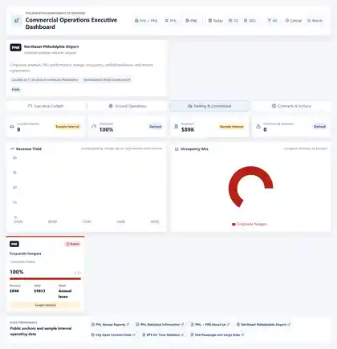
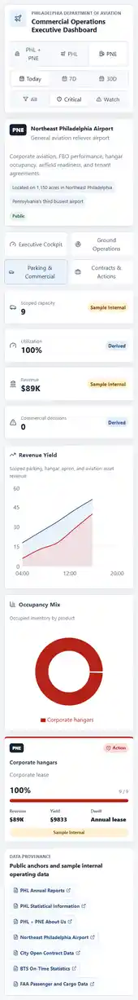

# PHL + PNE Commercial Operations Executive Dashboard

Prototype v0 of an executive decision dashboard for the Philadelphia Department of Aviation portfolio: Philadelphia International Airport (PHL) and Northeast Philadelphia Airport (PNE).

The dashboard frames airport commercial performance as an operating story rather than a set of disconnected charts. PHL is treated as the commercial service hub where passenger volume, parking yield, ground operations, and terminal service contracts drive daily risk. PNE is treated as the general aviation reliever airport where corporate aviation, FBO coordination, hangar utilization, transient apron use, and tenant agreements are the primary commercial levers.

## Prototype V0 Screenshots

### Executive Cockpit



### PNE Parking And Commercial Critical Filter



### Mobile View



## What The Dashboard Is

This is a Vite, React, and TypeScript prototype for daily executive review. It is designed around exception-driven decision making: the first screen answers what needs attention, why it matters, who owns it, and what decision is required.

The dashboard includes four primary views:

- **Executive Cockpit**: portfolio KPIs, risk cards, today's exceptions, and a ranked decision worklist.
- **Ground Operations**: SLA compliance, delay contributors, staffing coverage, and airfield/terminal alerts.
- **Parking & Commercial**: parking, hangar, apron, revenue yield, utilization, overflow risk, and revenue leakage actions.
- **Contracts & Actions**: vendor health, renewal exposure, SLA risk, procurement pipeline, and executive approvals.

The interface uses explicit data provenance labels so a reviewer can distinguish public data anchors from sample internal operational data and derived metrics.

## Data Used

Prototype v0 uses a hybrid data model. Public sources establish the operating context, while typed local fixtures simulate internal feeds that would normally come from airport systems, vendors, or contract management tools.

| Data category | Used for | Provenance |
| --- | --- | --- |
| PHL annual reports, statistical information, and fast facts | Passenger/commercial context and public operating anchors | Public |
| PNE public airport profile | PNE role, reliever-airport context, based aircraft, and general aviation positioning | Public |
| City of Philadelphia contract data and PHL contracting information | Public contract/procurement context | Public |
| FAA passenger/cargo and airport planning data | Aviation activity context | Public |
| BTS on-time statistics | Delay and reliability context | Public |
| Parking occupancy, hangar utilization, apron use, and product yield | Revenue, utilization, and commercial capacity decisions | Sample Internal |
| Turn SLA, ramp staffing, baggage maintenance, and airfield readiness | Ground operations exceptions and service risk | Sample Internal |
| Vendor SLA, renewal dates, contract value, and issue queues | Contract exposure and executive action workflow | Sample Internal |
| Readiness score, revenue at risk, contract risk exposure, and open decision count | Portfolio-level executive signals | Derived |

Public anchors are linked in the app footer:

- [PHL Annual Reports](https://www.phl.org/business/reports/annual-report)
- [PHL Statistical Information](https://www.phl.org/business/investor-information/statistical-information)
- [PHL + PNE About Us](https://www.phl.org/about/about-us)
- [Northeast Philadelphia Airport](https://www.phl.org/PNE)
- [City Open Contract Data](https://www.phila.gov/contracts/data/)
- [BTS On-Time Statistics](https://www.transtats.bts.gov/ONTIME/)
- [FAA Passenger and Cargo Data](https://www.faa.gov/airports/planning_capacity/passenger_allcargo_stats/passenger)

## Strategic Story

The story of the dashboard is that airport commercial performance is an operating system. Revenue risk often starts as an operational constraint, then becomes a commercial decision, and eventually turns into a contract or procurement action if it is not addressed.

Prototype v0 surfaces that chain in a few ways:

- **PHL parking pressure becomes a revenue decision**: garage constraints and economy spillover are translated into utilization, yield, and revenue-at-risk signals.
- **Ground operations drive commercial outcomes**: ramp coverage, baggage maintenance, and turn SLA issues are shown next to financial impact instead of being isolated in an operations report.
- **Contracts become active risk instruments**: vendor renewals, SLA breaches, and procurement stages are tied to action owners and due dates.
- **PNE is not an afterthought**: PNE appears as a distinct commercial asset portfolio, emphasizing hangar demand, corporate aviation readiness, FBO coordination, and transient apron revenue.
- **Executive attention is ranked**: domain risk scores and the worklist organize decisions by urgency, not by department.

The intended executive question is not only "what happened?" It is "which commercial risk requires a decision today, and what is the recommended action?"

## How It Was Built

- **Frontend**: Vite + React + TypeScript
- **Charts**: Recharts
- **Icons**: lucide-react
- **Data**: typed local fixtures in `src/data/dashboardData.ts`
- **Design approach**: responsive executive dashboard, compact hierarchy, clear filters, constrained status colors, no hidden provenance

Core files:

- `src/App.tsx`: dashboard layout, filtering, charts, and view composition.
- `src/data/dashboardData.ts`: typed prototype data for PHL, PNE, KPIs, events, parking, contracts, and decisions.
- `src/types/dashboard.ts`: shared TypeScript interfaces.
- `src/styles.css`: responsive executive dashboard styling.

## Run Locally

```bash
pnpm install
pnpm dev
```

Then open:

```text
http://127.0.0.1:5173
```

Production build:

```bash
pnpm build
```

## Prototype Status

This is prototype v0. It is not a production BI deployment and does not connect to live airport, parking, contract, or aviation systems. Internal operational metrics are intentionally marked as sample data until real feeds are available.

## Recommended Next Steps

- Connect real parking occupancy, transaction, and reservation data.
- Add live or scheduled BTS/FAA ingestion for aviation performance context.
- Replace sample SLA and staffing fixtures with ground operations system feeds.
- Map contract data to vendor master, procurement stage, SLA history, and renewal workflow systems.
- Add role-based views for executive leadership, commercial management, operations, and procurement.
- Add audit trails for decision status changes and executive approvals.
