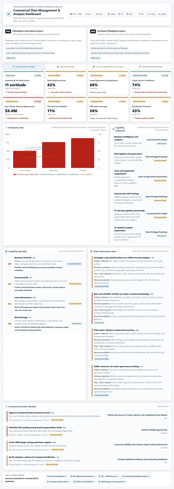
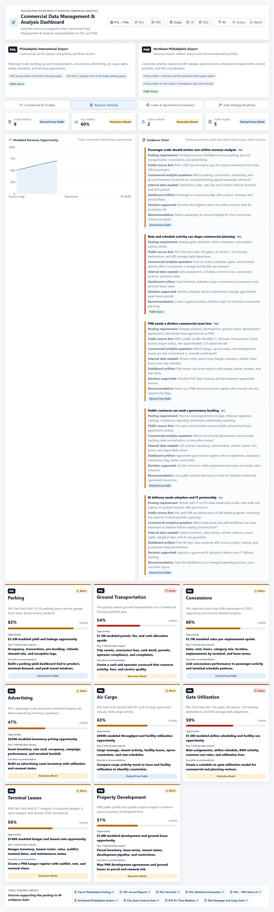
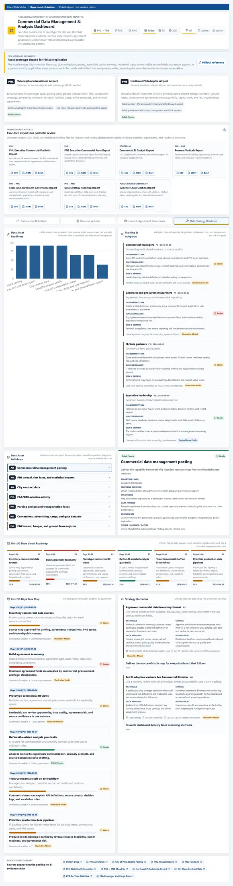
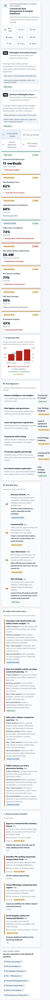

# PHL + PNE Commercial Data Management & Analysis Dashboard

Commercial analytics prototype for Philadelphia International Airport (PHL) and Northeast Philadelphia Airport (PNE), mapped to the City of Philadelphia `Director, Commercial Data Management & Analysis - Department of Aviation` capability framework.

This is a public-source commercial analytics prototype. It uses public PHL/PNE, City, FAA, and BTS references as evidence, labels non-public operating details as illustrative models, and demonstrates how a City-friendly executive dashboard could organize commercial data, governance, agreements, template-based metadata intake, adoption, predictive refresh signals, and report exports.

Deployed prototype: [phl-pne-commercial-ops-dashboard-three.vercel.app](https://phl-pne-commercial-ops-dashboard-three.vercel.app/)

Companion briefing deck: [PHL + PNE Commercial BI Executive Briefing](docs/briefing/phl-pne-commercial-bi-executive-briefing.pptx)

## Prototype Screenshots

### Commercial BI Cockpit



### Revenue Verticals



### Data Strategy Roadmap



### Mobile View



## What This Demonstrates

- Commercial BI design for a two-airport portfolio covering PHL and PNE.
- Public-data research translated into executive metrics, evidence chains, and action lists.
- Data governance thinking for lease/agreement hygiene, source ownership, refresh cadence, quality status, and access status.
- Portfolio analytics across parking, ground transportation, concessions, advertising, property development, terminal leases, ground leases, air cargo, gates, airline schedules, and aviation activity.
- Stakeholder enablement through a first-90-days roadmap, training/adoption items, and IT/ETL partnership backlog.
- Responsible AI framing where AI-assisted analysis supports summarization and anomaly prompts without replacing source validation.
- City-friendly UI/UX direction guided by [PhilaUI](https://ui.phila.gov/) and the [CityOfPhiladelphia/phila-ui](https://github.com/CityOfPhiladelphia/phila-ui) standards/components reference, now presented as a small footer reference rather than a primary evidence source.
- Client-side CSV, JSON, and Markdown downloads for PHL, PNE, cockpit, revenue, agreement governance, roadmap, and evidence-chain reports.
- Workstream template upload for CSV/JSON files so department, unit, or group templates can preserve local columns while feeding centralized metadata reporting.
- Illustrative machine-learning readiness prediction that re-scores uploaded template coverage, confidence, custom fields, and executive remediation focus after each upload/refresh.
- Public agreement-access register that separates public contract/opportunity signals from internal lease economics, amendments, tenant terms, and compliance records.
- Feed connection blueprint for parking, concessions, ground transportation, cargo, gate/schedule activity, and PNE asset records.
- Source-quality scorecard with accountable owners, four-part scoring, next controls, and escalation rules.
- PHL and PNE leadership portfolio drilldowns with audience-specific decision questions and executive actions.
- Editable PowerPoint briefing deck that explains the dashboard story for interview or stakeholder discussion.

## How This Maps To The Posting

The posting is used as the explicit capability framework, not as the product identity. The dashboard turns the posting's responsibilities into working modules:

| Posting capability | Dashboard implementation |
| --- | --- |
| Business intelligence and analytics | Commercial BI cockpit with KPIs, risk map, trend model, source library, and decision worklist |
| Dashboards and reporting tools | Four-tab executive BI prototype with consistent airport, period, and severity filters |
| Strategic recommendations and operational improvements | Evidence-chain cards connecting public facts to business questions, internal data requests, and recommended action |
| Lease/agreement storage, retrieval, expirations, compliance, and tenant reporting | Public agreement-access register with public basis, managing unit, internal record gap, completeness, and recommended action |
| Staff training and tool adoption | Adoption workstream and first-90-days roadmap |
| ETL/data warehouse partnership with IT | Feed connection blueprint for parking, concessions, ground transportation, cargo, gates, schedules, and PNE assets |
| Cross-departmental data governance | Source-quality scorecard with accountable owners, stewardship controls, and escalation rules |
| AI-assisted analysis exploration | Governed AI guardrail roadmap item |

## How Public Data Becomes Commercial BI

The app uses a repeatable evidence chain:

`Posting requirement -> Public source fact -> Citation -> Trend signal -> Template upload / refresh -> Predictive readiness signal -> Commercial analytics question -> Internal data needed -> Dashboard/reporting artifact -> Decision or operational improvement supported`

Example: PHL public facts show more than 30M 2025 passengers, 126 gates, 16,126 parking spaces, 449,761 square feet of cargo space, 28 carriers, 134 nonstop destinations, January 2026 passenger/cargo/activity figures, and a $1.8B PHL/PNE capital program. The dashboard converts those facts into commercial questions about parking yield, concessions coverage, advertising inventory, cargo facility use, gate/schedule utilization, and data pipeline priorities.

PNE is treated as a distinct commercial asset portfolio. The PNE public page describes 1,150 acres, Pennsylvania's third busiest airport status, on-call Customs/Immigration/USDA services, and approximately 215 based aircraft. Current PHL Fast Facts lists 1,118 acres, approximately 167 based aircraft, 85 T-hangars, nine corporate hangars, six open hangars, 8,910 January 2026 movements, and active capital projects. The dashboard treats that public-source difference as a data-governance signal before translating PNE into hangar, tenant, ground lease, and development-agreement reporting needs.

Commercial agreement data is handled with the same provenance discipline. Public City and PHL pages expose agreement categories and opportunity routing, including professional services, commodities, concession agreements, public works context, and the PHL Contracts Hub path. They do not expose authoritative airport lease economics, amendments, tenant performance, or renewal/compliance detail. The dashboard therefore replaces illustrative lease values with a public agreement-access register and makes the internal record request explicit.

## Data Used

| Data category | Used for | Provenance |
| --- | --- | --- |
| City of Philadelphia posting | Capability framework for Commercial BI, data governance, agreements, adoption, IT partnership, and AI-assisted analysis | Public Source |
| PHL annual reports, Fast Facts, statistical information, and airport pages | Passenger/activity context, gates, parking, cargo, carrier/destination, capital program, and commercial portfolio narrative | Public Source |
| PNE public airport profile and Fast Facts | Reliever-airport context, based-aircraft context, hangar inventory, tenant/hangar/ground-lease lens | Public Source |
| City open contract data, commodities contracts, professional services contracts, and PHL contracting opportunities | Public procurement and agreement-access starting point; internal lease/agreement records still required for authoritative governance | Public Source |
| FAA passenger/cargo data and BTS on-time data | Passenger, cargo, schedule, reliability, and aviation-activity context | Public Source |
| Revenue vertical visibility, agreement completeness, internal feed readiness, and BI adoption | Illustrative model of internal commercial data to request and govern | Illustrative Model |
| Team-owned uploaded templates, custom columns, qualitative notes, morale/satisfaction fields, and metadata classifications | Centralized reporting intake while preserving current unit workflows | Illustrative Model |
| Feed connection blueprint and source-quality scores | ETL/data warehouse planning, owner accountability, controls, and escalation | Illustrative Model / Derived From Public |
| Public observations converted into business questions and recommendations | Inference layer connecting public evidence to strategic action | Derived From Public |

Public anchors are linked in the app footer:

- [City of Philadelphia posting](https://jobs.smartrecruiters.com/CityofPhiladelphia/744000124935537--director-commercial-data-management-analysis-department-of-aviation-)
- [PHL Annual Reports](https://www.phl.org/business/reports/annual-report)
- [PHL Fast Facts](https://www.phl.org/about/news/fast-facts)
- [PHL Statistical Information](https://www.phl.org/business/investor-information/statistical-information)
- [PHL + PNE About Us](https://www.phl.org/about/about-us)
- [Northeast Philadelphia Airport](https://www.phl.org/PNE)
- [City Open Contract Data](https://www.phila.gov/contracts/data/)
- [PHL Contracting Opportunities](https://www.phl.org/business/contracting-opportunities)
- [City Commodities Contracts](https://www.phila.gov/contracts/data/commodities/)
- [City Professional Services Contracts](https://www.phila.gov/contracts/data/professional-services/)
- [BTS On-Time Statistics](https://www.transtats.bts.gov/ONTIME/)
- [FAA Passenger and Cargo Data](https://www.faa.gov/airports/planning_capacity/passenger_allcargo_stats/passenger)

## Capability Map

The dashboard is organized around four views:

- **Commercial BI Cockpit**: portfolio KPIs, role capability map, data maturity trend, evidence chains, source-quality scorecard, leadership drilldowns, feed blueprint, and commercial decision worklist.
- **Revenue Verticals**: parking, ground transportation, concessions, advertising, cargo, gate utilization, airline schedules, PNE hangars, and development-agreement opportunity views.
- **Lease & Agreement Governance**: public agreement-access register, managing unit, public basis, internal record gap, completeness, compliance flags, and action needs.
- **Data Strategy Roadmap**: source inventory, clickable data-asset drilldowns, feed connection plan, source-quality scorecard, leadership drilldowns, Commercial staff adoption details, IT/data partnership needs, AI-assisted analysis guardrails, visual 90-day roadmap, and strategy choices.
- **Downloadable Reports**: client-side CSV, JSON, and Markdown exports for airport-level and module-level executive review.
- **Template Metadata Intake**: CSV/JSON upload path for team-owned report templates. Added fields are classified as mapped or custom and as qualitative or quantitative.
- **Predictive Refresh Layer**: illustrative ML readiness scoring that updates when a workstream template is uploaded or refreshed.
- **Executive Briefing Deck**: editable PowerPoint narrative that turns the prototype into a concise stakeholder story.

## Codebase Walkthrough

- `src/types/dashboard.ts`: shared TypeScript interfaces for airports, sources, KPIs, commercial verticals, data assets, public agreement-access records, feed connections, source-quality scores, leadership drilldowns, evidence-chain insights, adoption items, roadmap items, and decisions.
- `src/data/dashboardData.ts`: typed local fixtures, source references, current public facts, illustrative internal models, capability map, commercial verticals, agreement-access records, feed connection plan, source-quality workflow, leadership drilldowns, data assets, insight chains, roadmap, and decision worklist.
- `src/App.tsx`: dashboard state, filter/derived-metric functions, report serializers, chart transformations, reusable components, source-quality/feed/drilldown panels, and four tab compositions.
- `src/styles.css`: responsive City-friendly dashboard styling, civic service bar, report cards, status treatments, provenance badges, charts, tables, roadmap visuals, and mobile behavior.
- `docs/briefing/phl-pne-commercial-bi-executive-briefing.pptx`: companion editable PowerPoint deck explaining the dashboard story.

Inline comments are included where they clarify the data model, provenance boundary, filter behavior, derived chart values, and dashboard composition.

## Data Provenance

The app uses three labels:

- `Public Source`: directly available public information such as the posting, PHL/PNE pages, City data, FAA, and BTS. These sources anchor the context and citations, but they are not substitutes for unit-owned operating records.
- `Derived From Public`: analytical inference from public facts, such as turning passenger scale into a commercial BI question.
- `Illustrative Model`: realistic internal operating data or workflow metadata that is not publicly available, such as lease completeness, parking yield opportunity, feed readiness, BI adoption progress, staff morale, role friction, satisfaction notes, or custom template fields. The intent is for teams to keep their workflow templates while a centralized system captures metadata for executive decision-making.

## Run Locally

```bash
pnpm install
pnpm dev
```

Then open:

```text
http://127.0.0.1:5173
```

Production build:

```bash
pnpm build
```

## Prototype Status

This is prototype v1.5. It is not a production BI deployment and does not connect to live airport, parking, lease, contract, concessions, gate, cargo, or aviation systems. Public contract pages are used for agreement-access discovery, but authoritative lease economics, amendments, tenant terms, renewal history, and compliance records still require internal systems. Internal operational metrics, uploaded template parsing, feed connection scoring, and predictive readiness scoring are intentionally marked as illustrative models until real feeds and approved models are available.

## Changelog

### v1.5 - Agreement access, feed accountability, source quality, and briefing deck

Added:

- Public agreement-access register replacing illustrative lease-value rows with public basis, access status, internal record needed, managing unit, completeness, and action fields.
- Public source links for PHL Contracting Opportunities, City Commodities Contracts, and City Professional Services Contracts.
- Feed connection blueprint for parking, concessions, ground transportation, cargo, gate/schedule activity, and PNE asset records.
- Source-quality scoring workflow with accountable owners, completeness/freshness/lineage/stewardship scores, next controls, and escalation rules.
- PHL and PNE leadership portfolio drilldowns with decision questions, feed gaps, and executive actions.
- Source Quality and Feed Accountability downloadable report.
- Companion editable PowerPoint briefing deck in `docs/briefing`.

Changed:

- Lease & Agreement Governance now distinguishes public agreement-access signals from internal authoritative agreement records.
- Cockpit and Data Strategy Roadmap now surface source quality, feed accountability, and leadership drilldowns.
- README now documents the public contract-data access boundary and the implemented v1.5 additions.

Removed:

- Recommended next-step bullets that are now implemented in the prototype.

### v1.4 - Template intake, metadata provenance, and predictive refresh layer

Added:

- Workstream template upload area for CSV/JSON files with mapped/custom field detection and qualitative/quantitative classification.
- Illustrative ML readiness prediction that updates after uploaded template refreshes.
- BI Maturity Path narrative and upload control for template-driven prediction.
- Provenance explainer clarifying `Public Source`, `Illustrative Model`, and decision metadata.
- Evidence-chain predictive refresh note.
- PNE evidence chain now shows both the PNE public profile and current PHL Fast Facts when their acreage and based-aircraft figures differ.
- Filter description text explaining airport, period, and status filters.
- Capability Risk Map score display as `Score` and `current/100`.

Changed:

- Moved the PhilaUI reference into a smaller centered footer-style note.
- Removed the top service-bar phrase `PhilaUI-aligned civic interface pattern`; the bar now reads only City of Philadelphia / Department of Aviation.
- Colored Action and Watch filter icons red and yellow.
- Updated README to explain centralized metadata intake, team-owned templates, and qualitative executive context such as morale and satisfaction.

Removed:

- PhilaUI references from the main evidence source library so they do not compete with data/citation sources.

### v1.3 - City-standard UX, reporting, and executive strategy depth

Added:

- PhilaUI docs and CityOfPhiladelphia/phila-ui repo as public UI standard references.
- City-style civic service bar, blue/gold accenting, accessible control treatment, and a standards-alignment note explaining the React-to-PhilaUI replication path.
- Downloadable CSV, JSON, and Markdown reports for PHL, PNE, Commercial BI Cockpit, Revenue Verticals, Lease & Agreement Governance, Data Strategy Roadmap, and Evidence Chain citations.
- Source citation label, URL, citation date, and trend signal inside each evidence-chain card.
- Managing unit field in the agreement register model.
- Data strategy drilldown panel for source assets, including reporting layer, executive question, diagnostic, data nuance, and decision use.
- Visual first-90-days roadmap with priority, target date, progress, and executive signal.
- More detailed adoption and strategy-decision fields: target date, enablement task, success measure, risk if skipped, rationale, options, required data, delay risk, and review cadence.

Changed:

- Removed the interview-resource sentence from the dashboard header and replaced it with executive commercial BI framing.
- Expanded executive descriptions throughout the dashboard to better support decision-making.
- Reworked Data Strategy from static cards into selectable analysis paths and implementation visuals.
- Updated README and page metadata for the City-standard/reporting refresh.

Removed:

- Header copy that over-emphasized interview framing instead of the dashboard objective.

### v1.2 - Explicit posting-aligned interview resource

Added:

- City of Philadelphia posting as an intentional source and capability framework.
- Interview-resource framing in the app and README.
- Role capability map covering BI, dashboards, strategic recommendations, agreement governance, training, IT/ETL partnership, data governance, and AI-assisted analysis.
- Evidence-chain model from posting requirement to public fact, analytics question, internal data needed, dashboard artifact, and decision supported.
- Current public PHL/PNE facts from PHL Annual Reports, PHL Fast Facts, and the PNE public profile.
- Inline comments explaining provenance modeling, filters, derived chart values, and dashboard composition.

Changed:

- Refreshed dashboard copy, source library, data fixtures, README story, and screenshot previews for explicit interview use.
- Reframed public-source insights as evidence chains rather than generic public information story cards.

Removed:

- Prior neutral framing that no longer matched the intended interview-resource story.

### v1.1 - Public portfolio framing cleanup

Added:

- Changelog entry documenting the public portfolio framing cleanup.

Changed:

- Reframed README and dashboard language around Commercial Division duties, portfolio management, data governance, and BI operating model.
- Renamed visible alignment copy to capability alignment.
- Kept the same commercial analytics scope while simplifying the earlier framing.

Removed:

- Earlier source-framing language from README and app copy.
- Earlier framework link from the public evidence library.

### v1 - Commercial Data Management BI prototype

Added:

- Commercial Data Management & Analysis dashboard framing.
- New views for Commercial BI Cockpit, Revenue Verticals, Lease & Agreement Governance, and Data Strategy Roadmap.
- Public-first provenance labels: `Public Source`, `Illustrative Model`, and `Derived From Public`.
- Capability-alignment panel mapping dashboard modules to Commercial Division data duties.
- Public information story cards connecting public observations to internal data requests and executive recommendations.
- Commercial vertical model covering parking, ground transportation, concessions, advertising, property development, leases, cargo, gates, airline schedules, aviation activity, and PNE assets.
- Agreement governance model with completeness, compliance flags, value, expiration, and recommended action.
- First-90-days data strategy roadmap, data asset inventory, staff adoption items, IT partnership needs, and AI-assisted analysis guardrails.

Changed:

- Repositioned the app from an airport operations control-room dashboard to a Commercial Division BI prototype.
- Shifted KPIs away from ground-ops SLA and toward data readiness, commercial portfolio scope, agreement completeness, public-source confidence, revenue opportunity, and BI adoption.
- Reframed PHL/PNE filters around commercial strategy rather than daily operational exceptions.
- Updated README story, data model explanation, and strategic insights.

Removed:

- Primary `Ground Operations` tab.
- Ground-ops-first SLA, staffing, delay, and ramp exception framing as the main dashboard narrative.
- `Sample Internal` and `Derived` provenance labels in favor of clearer public-first terminology.

### v0 - Commercial operations executive prototype

- Initial Vite + React + TypeScript dashboard for PHL/PNE commercial operations.
- Included executive cockpit, ground operations, parking/commercial, and contract/action views.
- Added local fixtures, public source links, screenshots, and GitHub README.

## Recommended Next Steps

- Replace public agreement-access placeholders with authoritative internal lease/agreement records once approved access is available.
- Connect the feed blueprint to approved production ETL/data warehouse sources.
- Replace illustrative source-quality scoring with governed validation rules and signed-off data-owner thresholds.
- Add authentication, role-based access, and persistent uploaded-template storage if this moves beyond a static prototype.
- Add automated tests for report serialization, template parsing, and source-quality scoring once production rules are defined.
